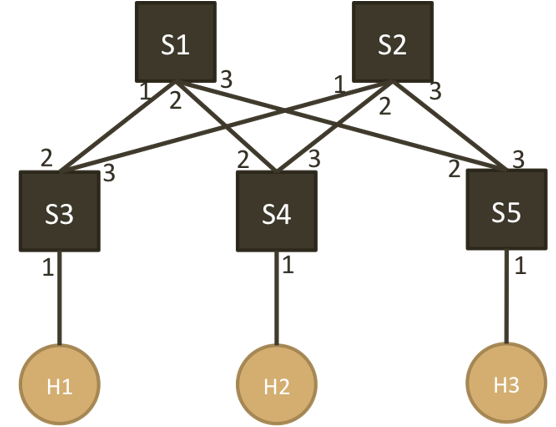
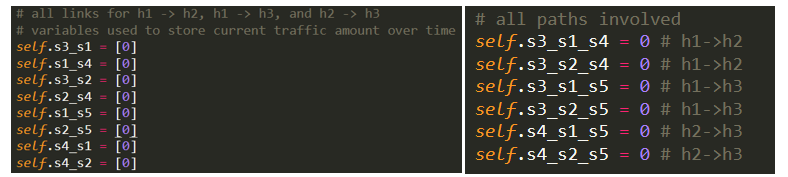
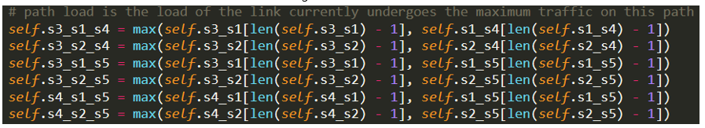
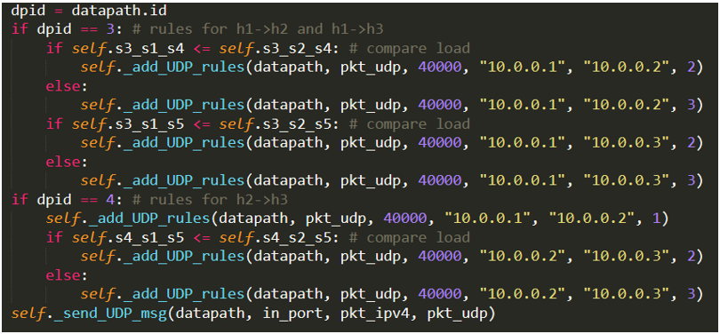
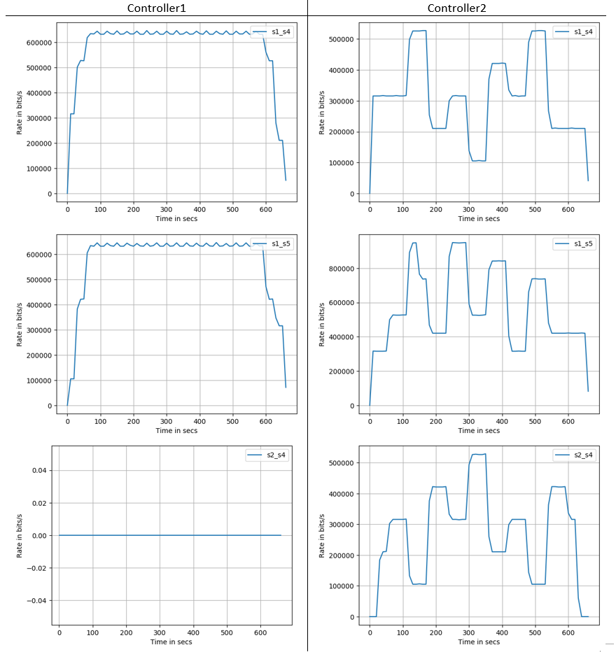
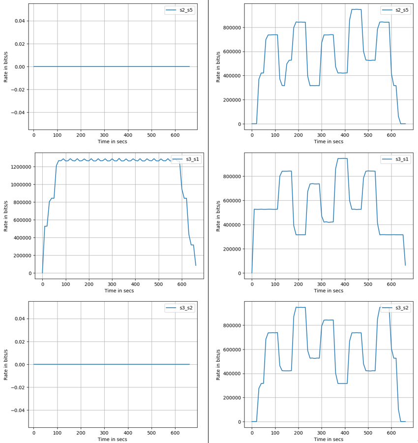
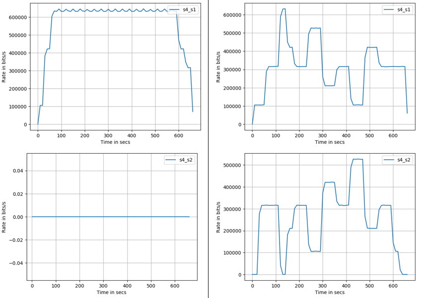

# Network-Monitoring-with-SDN
Nov, 2019 
The following topology is created and tested: 

<h3>Controller 1: </h3>

Flow path is predefined.

When a new flow arrives, always manage the flow to follow the paths as instructed below:
<ul>
	<li>H1 -> H2: S3 – S1 – S4</li>
	<li>H1 -> H3: S3 – S1 – S5</li>
	<li>H2 -> H3: S4 – S1 – S4</li>
</ul>

<h3>Controller 2:</h3>

Use the measured traffic (every 5 or 10 seconds) to manage flows so that all the links in the network is as evenly loaded as possible.

In order to distribute the new traffic to the path with minimum traffic, we need to compare the traffic load of different paths before adding rules. Then arranging new arriving flow’s path by adding rules based on the monitored path traffic.

In the monitor2 code, six global variables are used (right figure of Fig1) to record the current path load. The path load is the maximum load of all links in this path between switches. For example, path H1→S3→S1→S4→H2 has two links we need to compare: s3→s1 with load s3s1 and s1→s4 with load s1s4. So, the traffic load of path H1→S3→S1→S4→H2 equals to max{ s3s1, s1s4}. 

 
 

After the path load was calculated, we can add rules for new flows to the path experiencing the minimum traffic. We only need to do the above steps for switch s3 and s4, since switch s3 and s4 are the only two switches in this topology that can select which paths to forward new flows. For switch s1, it only needs to forward new flows to s4 if the package is from h1 to h2 and forward new flows to s5 if the package is from h1 to h3 or h2 to h3. Same reason for s2 and s5. Thus, the rules for s1, s2 and s5 are pre-installed in the switch handler.

 
<h3>Result</h3>

8 figures on the left are the result of controller1. 8 figures on the right are the result of controller2. 

 
 
 

Since the UDP traffic only flows from H1→H2, H1→H3, and H2→H3, there are 8 links we need to monitor: s3→s1, s3→s2, s4→s1, s4→s2, s1→s4, s1→s5, s2→s4, and s2→s5. From the above figures, we can observe that, for controller1, link s3→s1 has the most traffic all the time since there are 2 flows, H1→H2, H1→H3, using this link. Flow path s3→s1→s4/s5 experienced heavy traffic. Traffic are unbalanced. However, for controller2, all 8 links are utilized. Traffic are distributed among different flow paths. For flow H1→H2, path s3→s1→s4 and s3→s2→s4 were selected dynamically. For flow H1→H3, path s3→s1→s5 and s3→s2→s5 were selected dynamically. For flow H2→H3, path s4→s1→s5 and s4→s2→s5 were selected dynamically. The up-and-down characteristics in the right plots shows how the new traffic were distributed. For example, for plot s4_s1 and s4_s2, when rate goes up in plot s4_s1, rate in plot s4_s2 goes down, vice versa.
